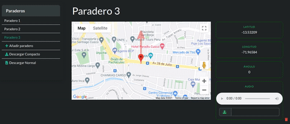

# Bus stop 

> Web tool to easily create JS files containing desired points and other features

## Live demo

<p align="center">
  <a href="https://anunciador-bus.web.app/">
    
  </a>
</p> 

## Sample output file

```JS
[
  {
    "nb": "Paradero 1",
    "la": "-13.53027",
    "lo": "-71.96679",
    "na": "70.84",
    "ru": ""
  },
  {
    "nb": "Paradero 2",
    "la": "-13.53027",
    "lo": "-71.96679",
    "na": "0",
    "ru": ""
  },
  {
    "nb": "Paradero 3",
    "la": "-13.53313",
    "lo": "-71.96925",
    "na": "83.30",
    "ru": ""
  },
  {
    "nb": "Paradero 4",
    "la": "-13.53234",
    "lo": "-71.96519",
    "na": "96.84",
    "ru": "thepath.mp3"
  }
]
```

## How to use it

1. Go to https://anunciador-bus.web.app/
2. Click on the main title to change the point name.
3. On the map: Click on the map to set the location.
4. On the map: Click on the marker to set the course.
5. On right panel: See the values set.
6. On right panel: Add a audio file.
6. On right corner: Delete the point.
7. On left panel: Add a new item and repeat steps from 2 to 6.
8. On left panel: Download the generated file as JSON or JSON compact


## Author

👤 Franco Rosa
- Github: [@FrancoRosa](https://github.com/FrancoRosa)
- Linkedin: [Franco Rosa](https://www.linkedin.com/in/francoro)

## Show your support

Give a ⭐️ if you like this project!

## 📝 License

This project is [MIT](https://opensource.org/licenses/MIT) licensed.